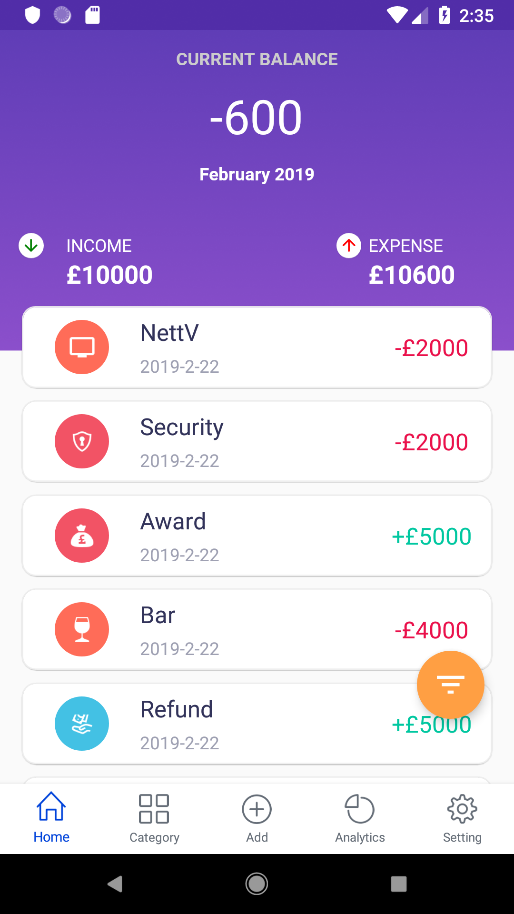
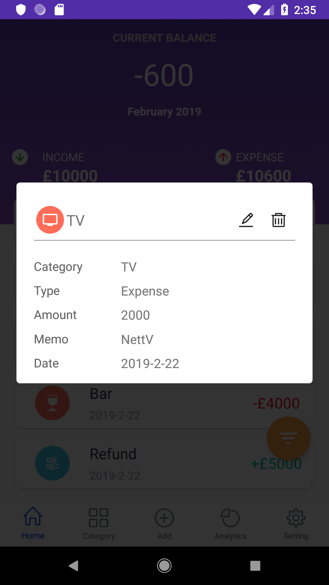
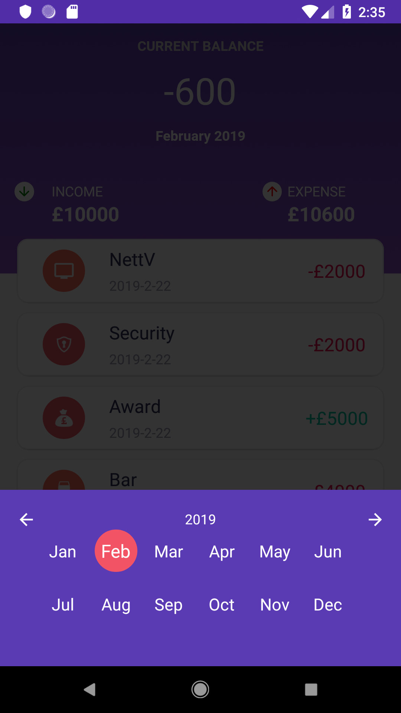
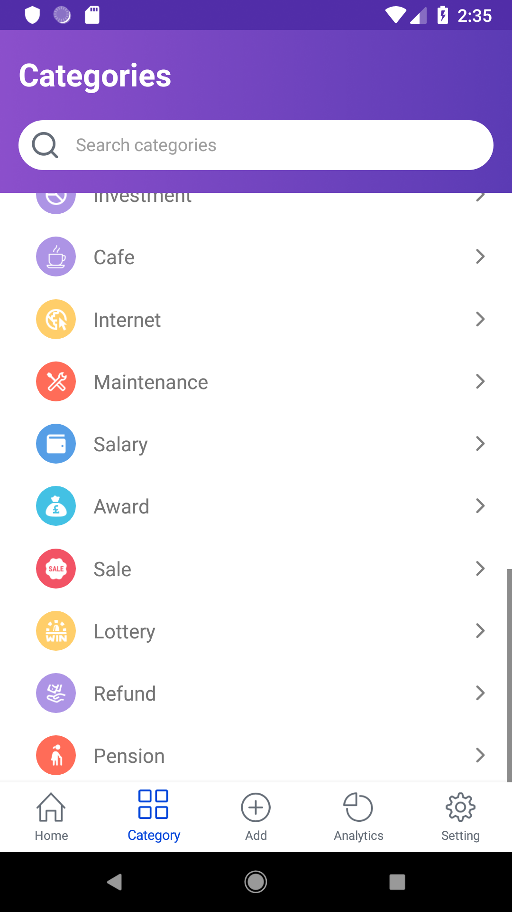
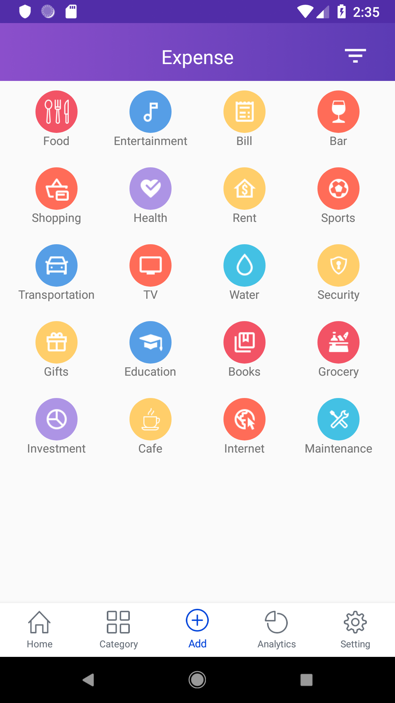
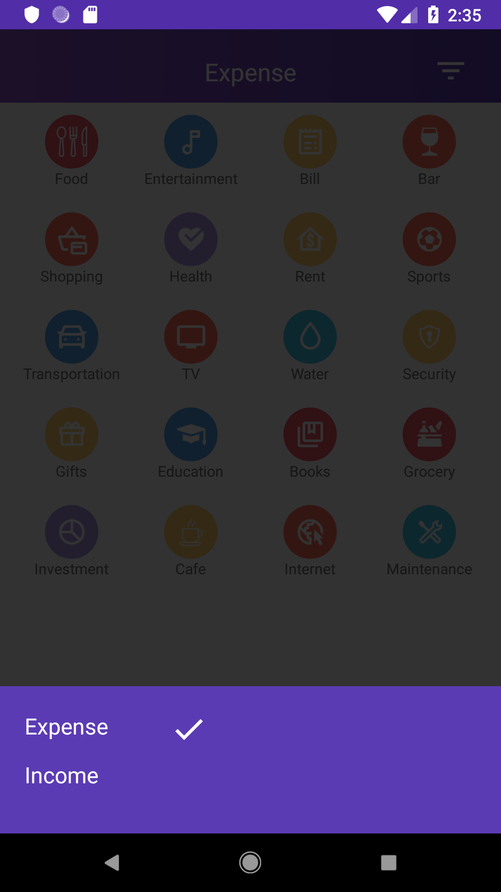

# GrowRich
Expense tracker app developed with react native 

## Framework used
* React Native
* Sqlite(database)
* Redux(State Management)
* wix React Native Navigation (Navigation)
* Victory Native(Data Visualization)
* react-native-splash-screen (to generate native splash screen)

## Install App from goolge play 

## Screenshots
  

